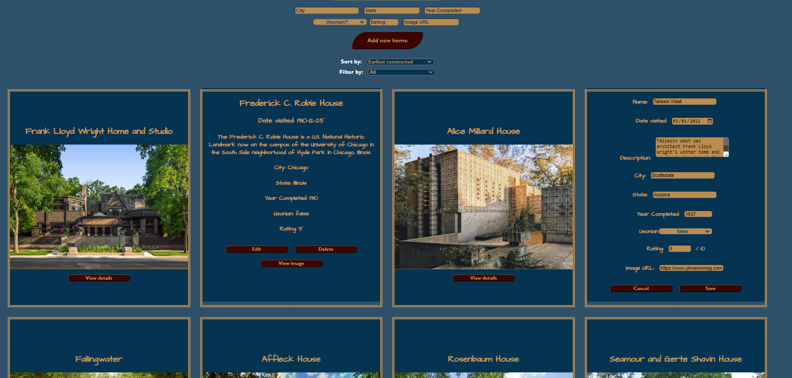

# Frank Loyd Wright Travel Journal

The Frank Lloyd Wright Travel Journal is a simple app that allows users to record details about their visits to homes designed by the father of American architecture, Frank Lloyd Wright. Whether you're a dedicated architecture enthusiast or simply a fan of Wright's iconic designs, this app provides a convenient way to document and organize your experiences.


# Features

• **View Visited Homes:** Users can browse a list of homes they have visited, along with essential details such as the name, date of visit, location, description, and an image of the home.

• **Add New Homes:** Easily add new entries to your travel journal by providing information about the visited home, including its name, date, location, description, and an image.

• **Edit Entries:** Update the details of your previous entries, such as correcting information or adding additional notes.

• **Delete Entries:** Remove entries from your travel journal if needed.

• **Full CRUD Capability:** The app supports Create, Read, Update, and Delete operations, allowing you to manage your travel journal effectively.


# Technologies Used
• **React:** The app is built using the React framework, providing a fast and efficient user interface.

• **Create React App:** The project was bootstrapped using [Create React App](https://github.com/facebook/create-react-app), allowing for a streamlined development setup.

• **JSON Server:** A mock backend is provided using JSON Server, which serves the data stored in a db.json file.
# Usage

To use the Frank Lloyd Wright Travel Journal app locally, follow these steps:

1. Clone the repository to your local machine.

2. Open a terminal and navigate to the project directory.

3. Install the required dependencies by running `npm install`.

4. Start the backend server by running `json-server db.json --watch --port 8000` in a separate terminal window.

5. Start the development server by running `npm start` in the terminal.

6. Open your browser and visit http://localhost:3000 to access the app.


# JSON Data

If you need to repopulate the db.json file after deleting cards, you can use the following JSON data:

#### `db.json starter data:`

```yaml
{
  "flwHomes": [
    {
      "id": 1,
      "name": "Frederick C. Robie House",
      "date": "1910-12-25",
      "description": "The Frederick C. Robie House is a U.S. National Historic Landmark now on the campus of the University of Chicago in the South Side neighborhood of Hyde Park in Chicago, Illinois. ",
      "city": "Chicago",
      "state": "Illinois",
      "completed": 1910,
      "usonian": false,
      "image": "https://live.staticflickr.com/65535/49539496622_c997329f78_b.jpg",
      "rating": 5
    },
    {
      "id": 2,
      "name": "Frank Lloyd Wright Home and Studio",
      "date": "2003-06-02",
      "description": "The Frank Lloyd Wright Home and Studio is a historic house and design studio in Oak Park, Illinois, which was designed and owned by architect Frank Lloyd Wright. First built in 1889 and added to over the years, the home and studio is furnished with original Wright-designed furniture and textiles.",
      "city": "Oak Park",
      "state": "Illinois",
      "completed": 1889,
      "usonian": false,
      "image": "https://media.cntraveler.com/photos/5a8ee90e873a2240b39fffea/16:9/w_2560,c_limit/Frank-Lloyd-Wright-House-and-Studio-Tour_2018_StudioFacade_JamesCaulfield_July2017.jpg",
      "rating": 1
    },
    {
      "id": 3,
      "name": "Taliesin West",
      "date": "2021-03-01",
      "description": "Taliesin West was architect Frank Lloyd Wright's winter home and studio in the desert from 1937 until his death in 1959 at the age of 91. Today it is the headquarters of the Frank Lloyd Wright Foundation.",
      "city": "Scottsdale",
      "state": "Arizona",
      "completed": 1937,
      "usonian": false,
      "image": "https://www.phoenixmag.com/wp-content/uploads/2020/02/Taliesin-West_Front-evening-1_Photo-credit-Andrew-Pielage_copyright-Frank-Lloyd-Wright-Foundation.jpg",
      "rating": 0
    },
    {
      "id": 4,
      "name": "Fallingwater",
      "date": "2022-05-03",
      "description": "Everybody's favorite",
      "city": "Mill Run",
      "state": "Pennsylvania",
      "completed": 1939,
      "usonian": false,
      "image": "https://upload.wikimedia.org/wikipedia/commons/thumb/d/dd/Fallingwater%2C_also_known_as_the_Edgar_J._Kaufmann%2C_Sr.%2C_residence%2C_Pennsylvania%2C_by_Carol_M._Highsmith.jpg/1280px-Fallingwater%2C_also_known_as_the_Edgar_J._Kaufmann%2C_Sr.%2C_residence%2C_Pennsylvania%2C_by_Carol_M._Highsmith.jpg",
      "rating": 0
    },
    {
      "id": 5,
      "name": "Affleck House",
      "date": "2022-05-21",
      "description": "some description",
      "city": "Bloomfield Hills",
      "state": "Michigan",
      "completed": 1940,
      "usonian": true,
      "image": "https://franklloydwright.org/wp-content/uploads/2017/02/Affleck_House_dusk_9-3-14_0066-fused-dc2_br-1382x640.jpg",
      "rating": 0
    },
    {
      "id": 6,
      "name": "Rosenbaum House",
      "date": "2022-06-19",
      "description": "A noted example of his Usonian house concept, it is the only Wright building in Alabama, and is one of only 26 pre-World War II Usonian houses. Wright scholar John Sergeant called it \"the purest example of the Usonian.\" ",
      "city": "Florence",
      "state": "Alabama",
      "completed": 1940,
      "usonian": true,
      "image": "https://cdn.elebase.io/f73a5e12-7a94-4da0-96b6-40fd97435fd2/0d93ebe9-9504-472c-a420-96f8cb15e144-tend06a574fe5dfda9e5.jpg?w=680&h=382&fit=crop&rot=auto&dpr=2&q=75",
      "rating": 0
    },
    {
      "id": 7,
      "name": "Alice Millard House",
      "date": "202-07-02",
      "description": "Also known as La Miniatura, this house is one of four of Wright's \"textile block\" houses - all built in Los Angeles County. The initial critical response to Millard House and the textile block structures was not positive. Over the years, critical views of Millard House became positive, and it is now considered one of Wright's finest works.",
      "city": "Pasadena",
      "state": "California",
      "completed": 1923,
      "usonian": false,
      "image": "https://i.pinimg.com/originals/d9/4a/19/d94a1957742911e2b3a48b73541026cd.jpg",
      "rating": 0
    },
    {
      "id": 8,
      "name": "Seamour and Gerte Shavin House",
      "date": "2022-11-22",
      "description": "The Shavin House is Usonian - a style intended to represent the natvie architectural style of the United States.  Usonian homes lack ornamentation and instead focus on design integration between nature, community, and scale. It is the only building designed by Frank Lloyd Wright in Tennessee. ",
      "city": "Chattanooga",
      "state": "TN",
      "completed": 1952,
      "usonian": true,
      "image": "https://upload.wikimedia.org/wikipedia/commons/a/ac/Seamour_and_Gerte_Shavin_House.jpg",
      "rating": 0
    }
  ]
}
```

# Screenshot



# License

[MIT](https://choosealicense.com/licenses/mit/)


## Enjoy!